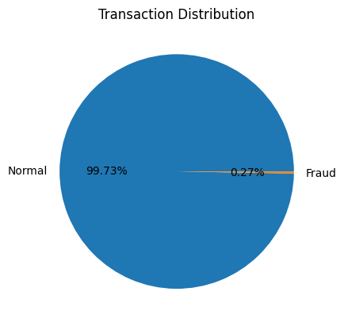
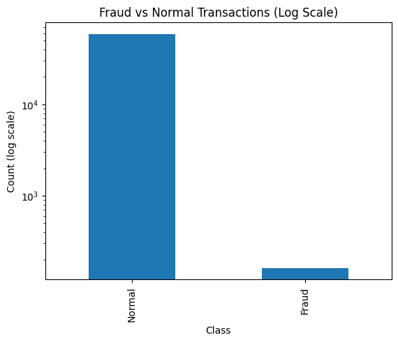
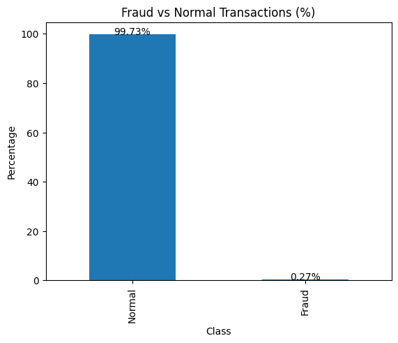
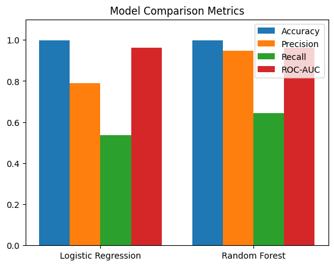
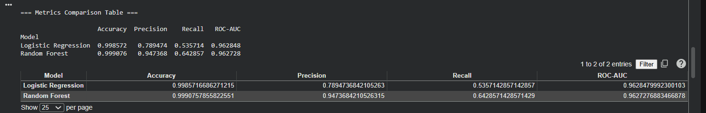

# Credit Card Fraud Detection using Machine Learning

This project focuses on detecting fraudulent credit card transactions using machine learning techniques on an imbalanced financial dataset.

# Project Overview

Credit card fraud is a major issue in the financial sector. This project builds and compares multiple machine learning models to identify suspicious transactions and improve fraud detection performance.

The system analyzes transaction patterns and classifies them as:
- **0 → Normal Transaction**
- **1 → Fraudulent Transaction**

Due to the highly imbalanced nature of the dataset, class weighting was applied and models were evaluated using **recall** and **ROC-AUC** rather than relying only on accuracy.

##  Key Features

- Built and trained multiple ML models:
  - Logistic Regression (baseline)
  - Random Forest Classifier (improved model)
- Handled imbalanced dataset using class weighting
- Compared models using:
  - Accuracy
  - Precision
  - Recall
  - ROC-AUC (industry-level metric)
- Visualized:
  - Fraud vs Normal transactions
  - Model performance comparison (bar charts)
- Generated a structured **metrics comparison table**

## Tech Stack Used

- Python  
- Pandas  
- NumPy  
- Scikit-learn  
- Matplotlib  

## Results & Analysis

- Random Forest outperformed Logistic Regression in detecting fraudulent transactions  
- ROC-AUC was used for reliable evaluation due to class imbalance  
- Visual and tabular comparisons were used to analyze model performance  

## Dataset

The dataset is sourced from Kaggle and contains anonymized credit card transactions.

https://www.kaggle.com/datasets/mlg-ulb/creditcardfraud

> Note: The dataset is highly imbalanced, with fraudulent transactions representing a very small percentage of total transactions.

## ▶️ How to Run

1. Open the notebook in Google Colab  
2. Download the dataset from Kaggle: https://www.kaggle.com/datasets/mlg-ulb/creditcardfraud  
3. Upload the file (`creditcard.csv`)  
4. Run all cells to train and evaluate models
   
## Output Screenshots:

Fraud vs Normal graph

Pie Chart:

Log Scale Graph:

Percentage Graph:

Model Comparison:

Metrics Comaprision Matrix:

## Key Learning:
- Importance of handling imbalanced datasets
- Why accuracy alone is not sufficient in fraud detection
- Practical application of machine learning in fintech

## Future Improvements: 
- Deploy as a web application using Streamlit
- Use advanced models like XGBoost
- Real-time fraud detection system

## Conclusion
This project demonstrates how machine learning can be applied to detect fraudulent financial transactions and highlights the importance of proper evaluation metrics in real-world scenarios.

## Author
Meher
